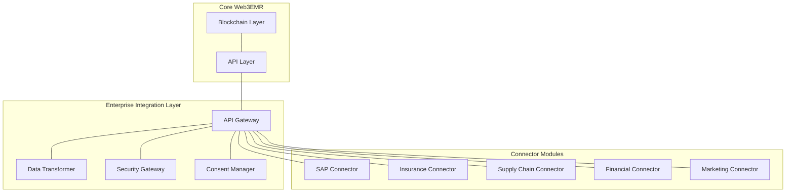

# Enterprise Integration Layer

This directory contains the implementation of the Enterprise Integration Layer for Web3EMR, as specified in Phase 6 of the PRD.

## Components

- **API Gateway**: Manages API access, authentication, and routing for enterprise systems
- **Data Transformer**: Converts between blockchain/Web3 data formats and enterprise formats
- **Security Gateway**: Manages security for enterprise connections
- **Consent Manager**: Handles patient consent for enterprise data sharing

## Connector Modules

- **SAP Connector**: Integration with SAP healthcare modules
- **Insurance Connector**: Integration with insurance systems using ACORD standards
- **Supply Chain Connector**: Integration with supply chain management systems
- **Financial Connector**: Integration with financial systems
- **Marketing/CRM Connector**: Integration with marketing and CRM systems

## Development Status

This module is currently in the initial implementation phase. Please refer to the PRD-Phase-6.txt document for detailed specifications.

## Architecture

## Getting Started

Documentation for setting up and using the Enterprise Integration Layer will be added as development progresses.
